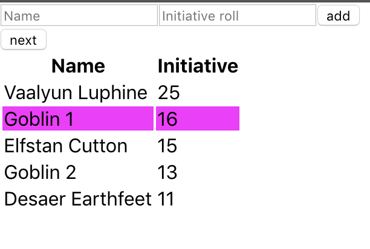

# RPG Turns

RPG Turns is a system-agnostic Tabletop RPG combat turn tracker, focused on giving an easy and better experience to all RPG players when controlling combat flow. We value small, independent and focused applications that we plan to integrate into a full-fledged RPG session management tool.

# Under the hood

We use [React](https://reactjs.org) to build an easy to use interface and [Firebase](https://firebase.google.com/) to store and share data between users so everyone is in the same turn.
Also, [Cypress](https://www.cypress.io/) is used as test runner for easy to write and effective testing.



# Contribution

If you would like to contribute with the project feel free to send Pull requests in the [github repository](https://github.com/hack-and-slash/rpg-turn) with features, fixes or documentation and visual improvements.

## Installing

```
npm install
or
yarn
```

## Running

```
npm start
or
yarn start
```

The app will be available on http://localhost:3000

## Testing

Run cypress
```
npm run cypress open
or
yarn cypress open
```
Click on `run all specs` button.

